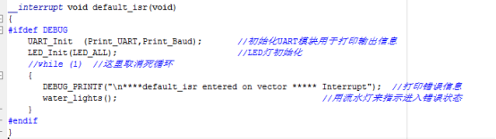
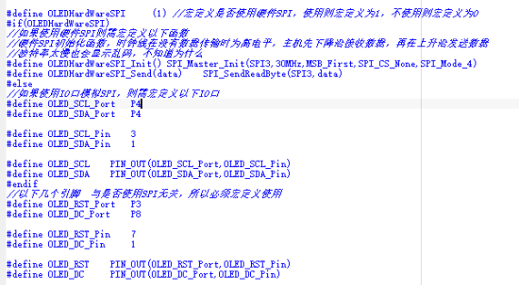
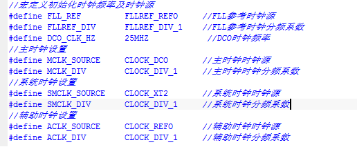
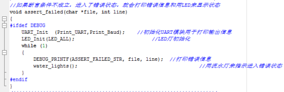
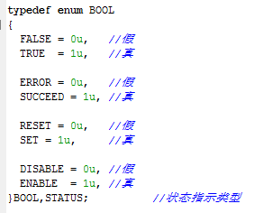
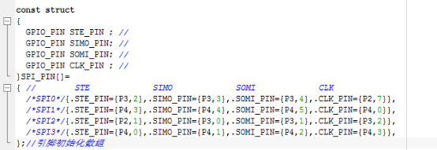

# MSP430F5529库函数使用说明
## 1：支持自定义中断服务函数
可以使用Set_Vector_Handler(VECTORn vector,__interrupt void pfunc_handler(void))函数设置某一中断的中断服务函数（该函数及枚举类型在vector.h里），这样可以不用使用#pragma vector=XXX_VECTOR来定义中断服务函数中断向量位置，且可以使多个中断进入同一个中断服务函数里
注意：
- 1，一定要在中断服务函数前加上__interrupt标志，否则会出错
- 2，最好先设置中断服务函数，再开启中断使能；
- 3，如果没有设置中断服务函数却使能了中断，当中断事件发生后会进入默认中断服务函数default_isr，所以使用中断时一定要配置中断服务函数；
默认中断服务函数default_isr：(位于msp430f5529_it.c文件里)
  

  
如：
```c
__interrupt void GPIO_IRQ_Handler()  //不需要使用#pragma vector=XXX_VECTOR定义
{
  if(GPIO_GetITStatus(P1,1)==TRUE)    //判断中断发生与否
  {
    GPIO_TurnBit(P1,0);             //翻转输出状态
    GPIO_ClearITPendingBit(P1,1);      	//清除位中断标志
  }
  if(GPIO_GetITStatus(P2,1)==TRUE)    //判断中断发生与否
  {
    GPIO_TurnBit(P1,0);             //翻转输出状态
    GPIO_ClearITPendingBit(P2,1);      	//清除位中断标志
  }
}
void main()
{
  //设置P1,P2端口中断服务函数为GPIO_IRQ_Handler
  Set_Vector_Handler(VECTOR_PORT1,GPIO_IRQ_Handler);  
  Set_Vector_Handler(VECTOR_PORT2,GPIO_IRQ_Handler);  
  GPIO_Init  (P1,1 ,GPI|PULL_UP|IRQ_FALLING);
  GPIO_Init  (P2,1 ,GPI|PULL_UP|IRQ_FALLING);                   //设为输入上拉且下降沿触发中断
  GPIO_ITConfig (P1,1 ,ENABLE);                         //使能中断
  GPIO_ITConfig (P2,1 ,ENABLE);                         //使能中断
  GPIO_Init     (P1,0 ,GPO);                           //设为输出方向
  EnableInterrupts();									//使能总中断			
  while(1);
}
```
## 2：所有模块中断已经默认关闭，使用时需要自己调用相应的函数打开
- 一般使用XXX_ITConfig (XXX,ENABLE/DISABLE)函数设置中断使能与禁止
- 使用(XXX_GetITStatus(XXX)==TRUE)判断中断发生与否
- 使用XXX_ClearITPendingBit(XXX)函数清除中断标志

注意：有些单源中断如定时器定时中断，里面不要判断中断标志，因为进入中断后会自动清除中断标志，所以会判断失败；
如：
```c
GPIO_ITConfig (P1,1 ,ENABLE);                         //使能中断
GPIO_ITConfig (P2,1 ,DISABLE);                         //禁止中断
__interrupt void GPIO_IRQ_Handler()  
{
if(GPIO_GetITStatus(P1,1)==TRUE)    //判断中断发生与否
{
GPIO_ Turn Bit (P1,0);             //翻转输出状态
GPIO_ClearITPendingBit(P1,1);      	//清除位中断标志
}
}
```
## 3：支持IO口或寄存器位操作
注意：寄存器及位参数可以使用宏定义，但不能使用变量，如：

PIN_DIR(P1,1)=0;                 //该位置0，P1.1设为输入方向,即把P1DIR的P1.1位置为0，不影响P1DIR的其它位

PIN_DIR(P1,0)=1;                 //该位置1，P1.0设为输出方向

PIN_OUT(P1,0)=!PIN_OUT(P1,0);    //P1OUT的P1.0输出翻转

BIT_VALUE_IN_BYTE (P4DIR,7) = 0;			 // P4.7DIR置为0

BIT_VALUE_IN_WORD (PBDIR,15) = 1;       // P4.7DIR置为1

PIN_OUT(P4,7) = PIN_IN(P1,1);       //检测P1.1引脚输入状态，并用P4.7显示出来

## 4：OLED及LCD可选择使用硬件SPI，并带printf函数，方便显示


## 5：设置时钟建议更改msp430f5529_system.h里的宏定义

这样便在主函数之前就已经设置好了时钟，不必再在主函数里调用时钟配置函数



如上面的配置便是初始化DCO时钟频率为25MHZ，

MCLK使用DCO（25MHZ）作为时钟源，不分频，则频率为：25MHZ。

SMCLK使用XT2（4MHZ）作为时钟源，不分频，则频率为：4MHZ。

ACLK使用REFO（32768HZ）作为时钟源，不分频，则频率为：32768HZ。

## 6：DEBUG模式下部分函数使用断言检测参数是否合理，若断言失败，则进入assert_failed函数



assert_failed是一个死循环函数，里面可能会调用串口打印错误信息，并用流水灯指示

建议在assert_failed以及default_isr函数里设置断点，以便调试模式下监测是否发生断言失败或进入未知中断！

## 8:common.h里定义了BOOL类型枚举变量，其所有代表假值或真值的枚举类型可以混用



如FALSE与ERROR,RESET,DISABLE相等，可以混用

## 9：P4端口支持重映设，但注意设置重映设函数里面已经将对应IO口设为第二功能且部分复用功能已设为输出放向，使用时应注意是否配置输出与输入方向；
如：GPIO_PinRemapConfig(P4,7,GPIO_Remap_MCLK);    //P4.7端口重映射为MCLK输出

## 10：PWM初始化使用可变参数初始化通道，可以根据需要初始化多个通道，
如：

TIMER_PWM_MultiChannel_Init(TIMER_A0, 1000, 3, TIMER_CH1, TIMER_CH2, TIMER_CH4);    //定时器TIMER_A0初始化输出PWM波，频率为1000Hz,初始化3个通道，分别是：TIMER_CH1,TIMER_CH2,TIMER_CH4，注意要输入要初始化通道数量。也可以使用下面的宏定义初始化PWM波，这样可以省去初始化通道数量

TIMER_PWM_Init(TIMER_A0,1000,TIMER_CH1,TIMER_CH2,TIMER_CH4);                        //定时器TIMER_A0初始化输出PWM波，频率为1000Hz,初始化3个通道，分别是： TIMER_CH1,TIMER_CH2,TIMER_CH4

## 11：定时器，SPI，I2C等模块初始化时通过查表查找复用引脚，要查看或修改该模块的复用引脚请参考模块对应.c文件上方的数组。下面是SPI模块引脚数组；



qq群：461507831，欢迎入群交流
